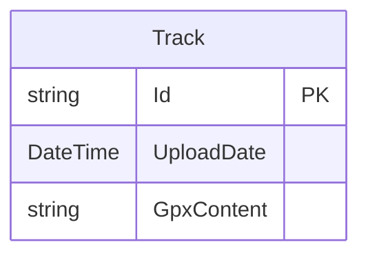

# Entity Specification

This document describes all entities used in the TrackShare backend system.

## Entities

### Track

Represents a GPS track that has been uploaded to the system.

**Properties:**

| Property | Data Type | Required | Max Length | Description |
|----------|-----------|----------|------------|-------------|
| Id | string | Yes | 256 | Unique identifier for the track provided by the client |
| UploadDate | DateTime | Yes | - | Date and time when the track was uploaded to the system |
| GpxContent | string | Yes | - | The raw content of the GPX file |

**Constraints:**
- `Id` is the primary key
- `Id` must be unique across all tracks
- `UploadDate` is automatically set on upload
- `GpxContent` contains the complete GPX XML data

**Notes:**
- The track identifier is provided by the myTracks app, not generated by the backend
- The GPX content is stored as-is without modification
- No user information is stored - tracks are anonymous
- Tracks are immutable once uploaded

## Entity Relationship Diagram

## Domain Model

The system currently uses a simple domain model with a single entity. As the system evolves, additional entities may be added to support features such as:
- Track metadata (extracted from GPX)
- Access control
- Track statistics
- User accounts

## Data Storage

- All entities are persisted in a relational database
- The repository pattern is used to abstract data access
- Entity Framework Core is used as the ORM

## Validation Rules

### Track
- `Id`: Must not be null or empty, maximum length 256 characters
- `UploadDate`: Must be a valid DateTime value
- `GpxContent`: Must not be null or empty, must be valid XML (GPX validation may be added)
